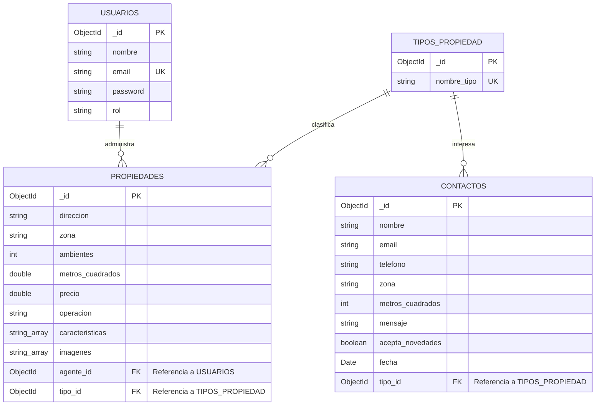

# Trabajo Práctico Intermedio: Diseño del Modelo de Datos (v3 - Final Personalizado)
**Curso:** Desarrollo Back End  
**Proyecto:** Nuevo Techo Propiedades & Hogar (ERP/Back-office de Inmobiliaria)  
**Autor:** Leandro Spitale  

---

## Sección 1: Elección del Dominio

Para el proyecto integrador de la cursada elegí diseñar la base de datos de mi web **"Nuevo Techo Propiedades & Hogar"**. La idea es que este desarrollo funcione como un **sistema de gestión interna (ERP/Back-office)** para el personal de la inmobiliaria. 

A diferencia de un portal público genérico donde cualquiera puede registrarse y publicar inmuebles, esta plataforma está pensada exclusivamente para el uso privado de nuestros agentes y administradores autorizados. Desde este panel privado, el equipo puede controlar el catálogo dinámico de la web pública (altas, bajas y modificaciones), registrar qué empleado es el responsable directo de cada propiedad y almacenar ordenadamente las solicitudes de tasación y contacto que los clientes envían desde la web.

---

## Sección 2: Diagrama del Modelo de Datos

A continuación se detalla la estructura lógica de la base de datos mediante un diagrama de entidad-relación usando la sintaxis de **Mermaid**, la cual se renderiza de forma visual y nativa directamente al abrir el archivo en la interfaz de GitHub.



### Detalle de Colecciones y Tipos de Datos (Orientado a Mongoose/MongoDB)

#### 1. Colección: `Usuarios`
Almacena las cuentas del personal de la inmobiliaria que tiene acceso al panel de administración.
*   `_id` (**ObjectId**): Identificador único de MongoDB (Clave Primaria).
*   `nombre` (**String**): Nombre y apellido del agente o administrador.
*   `email` (**String**): Correo corporativo obligatorio (Debe ser único para evitar cuentas duplicadas).
*   `password` (**String**): Contraseña de acceso encriptada (se procesará con Bcrypt en el Back-End).
*   `rol` (**String**): Permisos del usuario dentro del sistema (ej. `"administrador"` o `"agente"`).

#### 2. Colección: `Tipos_Propiedad`
Es una colección auxiliar que actúa como catálogo cerrado para estandarizar las categorías de los inmuebles.
*   `_id` (**ObjectId**): Identificador único de la categoría (Clave Primaria).
*   `nombre_tipo` (**String**): Nombre obligatorio y único de la categoría (ej. `"Casa"`, `"Departamento"`, `"Oficina"`, `"PH"`).

#### 3. Colección: `Propiedades`
Colección principal que almacena los inmuebles activos de la cartera de Nuevo Techo.
*   `_id` (**ObjectId**): Identificador único de la propiedad (Clave Primaria).
*   `direccion` (**String**): Dirección física exacta (calle, altura, piso, depto).
*   `zona` (**String**): Barrio o localidad para facilitar las búsquedas rápidas (ej. `"Palermo"`, `"Belgrano"`, `"Olivos"`).
*   `ambientes` (**Number** / **Integer**): Cantidad total de ambientes.
*   `metros_cuadrados` (**Number** / **Decimal**): Superficie total construida o de terreno.
*   `precio` (**Number**): Valor del inmueble en dólares (USD).
*   `operacion` (**String**): Tipo de transacción comercial (únicos valores permitidos: `"Venta"` o `"Alquiler"`).
*   `caracteristicas` (**Array de Strings**): Lista de amenidades y extras cualitativos (ej. `["Jardín", "Balcón", "Pileta", "Cochera"]`).
*   `imagenes` (**Array de Strings**): URLs o rutas relativas de las fotos de la propiedad (ej. `["/img/destacadas/casa_con_pileta.jpeg"]`).
*   `agente_id` (**ObjectId**): Clave foránea que conecta la propiedad con el agente responsable de su gestión (Referencia a la colección `Usuarios`).
*   `tipo_id` (**ObjectId**): Clave foránea que clasifica la propiedad según su categoría (Referencia a la colección `Tipos_Propiedad`).

#### 4. Colección: `Contactos` (Formulario de Tasaciones)
Almacena los mensajes enviados por los clientes a través del formulario de contacto/tasación de la web.
*   `_id` (**ObjectId**): Identificador único de la solicitud (Clave Primaria).
*   `nombre` (**String**): Nombre completo del cliente (Obligatorio).
*   `email` (**String**): Correo electrónico del cliente para poder responderle (Obligatorio).
*   `telefono` (**String**): Teléfono del cliente.
*   `zona` (**String**): Barrio de interés o donde se ubica el inmueble que quiere tasar.
*   `metros_cuadrados` (**Number** / **Integer**): Superficie aproximada para el cálculo de la tasación.
*   `mensaje` (**String**): Comentarios o detalles de la solicitud.
*   `acepta_novedades` (**Boolean**): Si el cliente tildó la opción de suscribirse a novedades.
*   `fecha` (**Date**): Registro temporal automático de cuándo se envió la solicitud (útil para el ordenamiento en el panel de control).
*   `tipo_id` (**ObjectId**): Clave foránea que asocia la consulta con el tipo de propiedad seleccionado en el formulario (Referencia a la colección `Tipos_Propiedad`).

---

## Sección 3: Justificación de "Embeber vs. Referenciar" (Estrategia de Datos)

Para estructurar la base de datos de Nuevo Techo elegí un enfoque híbrido, decidiendo con criterio qué datos conviene tener separados y cuáles conviene agrupar para que la web ande rápido y sin errores:

1.  **Colección `Tipos_Propiedad` (Referenciada):**
    *   **Para evitar un quilombo en los filtros:** Si ponía el tipo de propiedad como un simple texto libre embebido dentro de cada inmueble (ej. `tipo: "Depto"`), los agentes iban a escribir cualquier cosa por error. Uno iba a poner "Depto", otro "departamento", otro "Dpto" o "PH" con minúsculas. Cuando quisiéramos programar el buscador filtrado en React, se nos iba a romper todo o iba a ser un dolor de cabeza unificar criterios. Referenciar una colección estricta obliga a usar categorías estandarizadas.
    *   **Mantenibilidad total:** Si en el futuro decidimos renombrar la categoría `"Oficina"` por `"Local / Oficina Comercial"`, solo editamos un documento en `Tipos_Propiedad` y el cambio impacta de inmediato en todas las propiedades y contactos vinculados.
2.  **Colección `Usuarios` / Agentes (Referenciada):**
    *   **Evitar redundancia ineficiente:** Un mismo agente de Nuevo Techo va a administrar múltiples propiedades de la cartera. Si embebiéramos toda su información de contacto (nombre, email y contraseña encriptada) adentro de cada propiedad que tiene a cargo, estaríamos duplicando datos sensibles de forma masiva. Además, si ese agente cambia de correo, actualizar el dato en 50 casas por separado sería recontra ineficiente. Con la referencia `agente_id`, el empleado se edita en un único lugar de la colección `Usuarios` y listo.
3.  **Colección `Contactos` -> Referencia a `Tipos_Propiedad`:**
    *   **Coherencia con el Front-End:** El formulario de tasaciones de nuestra web tiene una lista desplegable (`<select>`) alimentada con los tipos de propiedades. Al enviar el ID del tipo, la base de datos se mantiene estructurada y coherente con las categorías de inmuebles que manejamos.
4.  **Amenidades e Imágenes (Embebidas dentro de `Propiedades`):**
    *   **Acá sí conviene embeber:** Las fotos de la propiedad (`imagenes`) y las amenidades cualitativas (como `caracteristicas: ["Pileta", "Balcón"]`) pertenecen pura y exclusivamente a ese inmueble. No tienen lógica propia fuera de la casa. Al embeberlas en Arrays de Strings dentro de `Propiedades`, optimizamos la velocidad de carga de la web: con una única consulta rápida de lectura al servidor (`GET /api/propiedades/:id`) traemos la ficha completa con sus fotos y características, reduciendo la latencia de la base de datos.

---

## Sección 4: Índices Propuestos

Para que nuestro servidor de Express responda de forma casi instantánea a los filtros y consultas que los clientes hacen desde la interfaz de React, propongo los siguientes índices:

1.  **Índice Único en `email` (Colección `Usuarios`):**
    *   *Propósito:* Garantiza a nivel del motor de base de datos que no existan agentes registrados con el mismo mail corporativo, bloqueando colisiones en el inicio de sesión.
2.  **Índice Compuesto en `precio` y `operacion` (Colección `Propiedades`):**
    *   *Propósito:* Optimiza las búsquedas más comunes y pesadas del catálogo de la web (ej. clientes que buscan inmuebles en `"Venta"` ordenados de menor a mayor precio, o que filtran por un rango de `"Alquiler"` de entre USD 400 y USD 900).
3.  **Índice en `zona` (Colección `Propiedades`):**
    *   *Propósito:* Acelera drásticamente la velocidad de respuesta de la base de datos cuando los usuarios usan la barra de búsqueda rápida de React escribiendo barrios específicos como `"Palermo"` u `"Olivos"`.
4.  **Índice en `fecha` (Colección `Contactos`):**
    *   *Propósito:* Optimiza la carga del Dashboard privado de los agentes, permitiendo ordenar y listar de forma descendente los mensajes y tasaciones que ingresan (los más recientes primero).

---

## Sección 5: Documentos de Ejemplo (Formato JSON)

A continuación, se presentan documentos de prueba consistentes entre sí por cada colección. Se utilizaron identificadores de MongoDB simulados de forma aleatoria (desordenados y no secuenciales) para que el modelo de datos sea completamente real, cuidando la **integridad referencial**:

### 1. Documentos de la Colección: `Usuarios`
```json
[
  {
    "_id": { "$oid": "66d86ef2e4b3c7d501a4bc81" },
    "nombre": "Leandro Spitale",
    "email": "leandro@nuevotecho.com.ar",
    "rol": "administrador"
  },
  {
    "_id": { "$oid": "66d86efae4b3c7d501a4bc83" },
    "nombre": "Carlos Gómez",
    "email": "carlos.gomez@nuevotecho.com.ar",
    "rol": "agente"
  }
]
```

### 2. Documentos de la Colección: `Tipos_Propiedad`
```json
[
  {
    "_id": { "$oid": "66d86f10e4b3c7d501a4bc91" },
    "nombre_tipo": "Departamento"
  },
  {
    "_id": { "$oid": "66d86f18e4b3c7d501a4bc92" },
    "nombre_tipo": "Casa"
  },
  {
    "_id": { "$oid": "66d86f21e4b3c7d501a4bc93" },
    "nombre_tipo": "Oficina"
  }
]
```

### 3. Documentos de la Colección: `Propiedades` *(Basado en las Cards reales de tu web)*
```json
[
  {
    "_id": { "$oid": "66d86f50e4b3c7d501a4bca1" },
    "direccion": "Av. del Libertador 1500, CABA",
    "zona": "Palermo",
    "ambientes": 3,
    "metros_cuadrados": 85.0,
    "precio": 120000.0,
    "operacion": "Venta",
    "caracteristicas": ["Jardín", "Balcón", "Apto Profesional"],
    "imagenes": ["/img/destacadas/casa.jpeg"],
    "agente_id": { "$oid": "66d86efae4b3c7d501a4bc83" },
    "tipo_id": { "$oid": "66d86f18e4b3c7d501a4bc92" }
  },
  {
    "_id": { "$oid": "66d86f5be4b3c7d501a4bca2" },
    "direccion": "Gorriti 4500, Palermo",
    "zona": "Palermo",
    "ambientes": 2,
    "metros_cuadrados": 45.0,
    "precio": 85000.0,
    "operacion": "Venta",
    "caracteristicas": ["Balcón", "Luminoso"],
    "imagenes": ["/img/destacadas/departamento centrico.jpeg"],
    "agente_id": { "$oid": "66d86efae4b3c7d501a4bc83" },
    "tipo_id": { "$oid": "66d86f10e4b3c7d501a4bc91" }
  },
  {
    "_id": { "$oid": "66d86f68e4b3c7d501a4bca3" },
    "direccion": "Sucre 2300, Belgrano",
    "zona": "Belgrano",
    "ambientes": 5,
    "metros_cuadrados": 180.0,
    "precio": 210000.0,
    "operacion": "Venta",
    "caracteristicas": ["Pileta", "Cochera", "Jardín"],
    "imagenes": ["/img/destacadas/casa_con_pileta.jpeg"],
    "agente_id": { "$oid": "66d86ef2e4b3c7d501a4bc81" },
    "tipo_id": { "$oid": "66d86f18e4b3c7d501a4bc92" }
  }
]
```

### 4. Documentos de la Colección: `Contactos` *(Basado en el Formulario real de tu web)*
```json
[
  {
    "_id": { "$oid": "66d86f9be4b3c7d501a4bcb1" },
    "nombre": "Esteban Pérez",
    "email": "esteban.perez@gmail.com",
    "telefono": "+54 11 9876-5432",
    "zona": "Olivos",
    "metros_cuadrados": 90,
    "mensaje": "Hola, solicito tasación para mi departamento de 3 ambientes en zona norte. Gracias.",
    "acepta_novedades": true,
    "fecha": { "$date": "2026-09-04T12:00:00Z" },
    "tipo_id": { "$oid": "66d86f10e4b3c7d501a4bc91" }
  }
]
```
