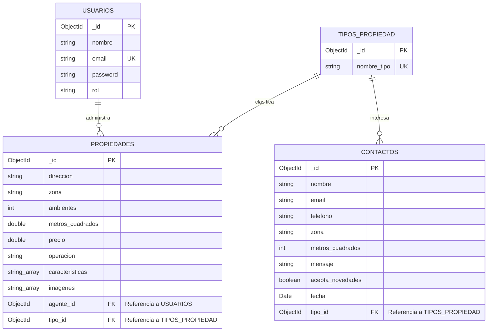

# Trabajo Práctico Intermedio: Diseño del Modelo de Datos (v4)
**Curso:** Desarrollo Back End  
**Proyecto:** Nuevo Techo Propiedades & Hogar (ERP/Back-office de Inmobiliaria)  
**Autor:** Leandro Spitale  

---

## Sección 1: Elección del Dominio

El dominio seleccionado consiste en un **Sistema de Gestión Interna y Back-office para la Inmobiliaria "Nuevo Techo Propiedades & Hogar"**. A diferencia de un portal público genérico, este sistema está diseñado para el uso interno exclusivo del personal de la inmobiliaria (agentes y administradores) con el fin de alimentar y controlar el catálogo dinámico de la web pública, gestionar el flujo de contactos y procesar tasaciones.

La plataforma permite:
1.  **Administrar el catálogo de propiedades:** Controlar altas, bajas y modificaciones (CRUD) de inmuebles en alquiler o venta, registrando sus características y amenidades detalladas.
2.  **Asignación de Agentes:** Vincular cada propiedad con el agente inmobiliario responsable directo de las visitas y la negociación.
3.  **Clasificación Estandarizada:** Normalizar categorías de inmuebles (Casa, Departamento, Oficina, PH) para evitar inconsistencias en las búsquedas.
4.  **Gestión de Consultas y Tasaciones:** Almacenar y ordenar cronológicamente las solicitudes enviadas por los clientes mediante el formulario de tasación de la web.

Los actores principales del sistema son los **Agentes** (con roles de *administrador* o *agente*), quienes gestionan las **Propiedades** y las categorías de **Tipos de Propiedad**. Por otro lado, la web registra los datos del formulario de **Contactos** (clientes interesados en tasar o consultar).

---

## Sección 2: Diagrama del Modelo de Datos

Estructura lógica y relaciones del modelo (DER):



### Detalle de Colecciones y Tipos de Datos (Orientado a Mongoose/MongoDB)

#### 1. Colección: `Usuarios`
Representa al personal autorizado para operar en el Back-End de la inmobiliaria.
*   `_id` (**ObjectId**): Identificador único del usuario (Clave Primaria).
*   `nombre` (**String**): Nombre completo del agente o administrador.
*   `email` (**String**): Correo electrónico corporativo (Único y obligatorio).
*   `password` (**String**): Contraseña encriptada (con Bcrypt) para validar el acceso.
*   `rol` (**String**): Permisos del sistema (ej. `\"administrador\"` o `\"agente\"`).

#### 2. Colección: `Tipos_Propiedad`
Catálogo auxiliar cerrado para evitar la dispersión de categorías de inmuebles.
*   `_id` (**ObjectId**): Identificador único de la categoría (Clave Primaria).
*   `nombre_tipo` (**String**): Nombre estandarizado (ej. `\"Casa\"`, `\"Departamento\"`, `\"Oficina\"`, `\"PH\"`). Único y obligatorio.

#### 3. Colección: `Propiedades`
Catálogo físico de propiedades del mercado que se expone en la web.
*   `_id` (**ObjectId**): Identificador único de la propiedad (Clave Primaria).
*   `direccion` (**String**): Calle, altura y datos de piso/depto.
*   `zona` (**String**): Barrio o localidad para facilitar agrupamientos (ej. `\"Palermo\"`, `\"Puerto Madero\"`, `\"San Isidro\"`).
*   `ambientes` (**Number** / **Integer**): Cantidad total de ambientes.
*   `metros_cuadrados` (**Number**): Superficie del inmueble.
*   `precio` (**Number**): Valor de mercado del inmueble en dólares (USD).
*   `operacion` (**String**): Tipo de transacción (únicos valores válidos: `\"Venta\"` o `\"Alquiler\"`).
*   `caracteristicas` (**Array de Strings**): Atributos cualitativos destacados (ej. `[\"Jardín\", \"Balcón\", \"Pileta\"]`).
*   `imagenes` (**Array de Strings**): Direcciones de almacenamiento o URLs de las imágenes (ej. `[\"/img/venta/casa.png\"]`).
*   `agente_id` (**ObjectId**): Clave foránea que referencia al agente responsable en la colección de `Usuarios`.
*   `tipo_id` (**ObjectId**): Clave foránea que referencia a la categoría de inmueble en la colección de `Tipos_Propiedad`.

#### 4. Colección: `Contactos` (Formulario de Tasaciones)
Registra las peticiones de contacto recibidas desde el Front-End en React.
*   `_id` (**ObjectId**): Identificador único de la solicitud (Clave Primaria).
*   `nombre` (**String**): Nombre del cliente interesado (Obligatorio).
*   `email` (**String**): Correo electrónico de contacto del cliente (Obligatorio).
*   `telefono` (**String**): Teléfono del cliente.
*   `zona` (**String**): Barrio de interés o donde se ubica el inmueble a tasar.
*   `metros_cuadrados` (**Number**): Superficie aproximada para tasación.
*   `mensaje` (**String**): Comentarios o detalles adicionales.
*   `acepta_novedades` (**Boolean**): Si el usuario aceptó recibir correos promocionales.
*   `fecha` (**Date**): Timestamp automático de creación para ordenamiento.
*   `tipo_id` (**ObjectId**): Clave foránea que referencia el tipo de inmueble de su interés en la colección `Tipos_Propiedad`.

---

## Sección 3: Justificación de "Embeber vs. Referenciar"

La arquitectura de datos de MongoDB nos ofrece flexibilidad, pero para garantizar la integridad de un ERP inmobiliario profesional, se optó por una estrategia híbrida:

1.  **Colección `Tipos_Propiedad` (Referenciada):**
    *   *Para evitar un quilombo en los filtros:* Si ponía el tipo de propiedad como un simple texto libre embebido dentro de cada inmueble (ej. tipo: "Depto"), los agentes iban a escribir cualquier cosa por error. Uno iba a poner "Depto", otro "departamento", otro "Dpto" o "PH" con minúsculas. Cuando quisiéramos programar el buscador filtrado en React, se nos iba a romper todo o iba a ser un dolor de cabeza unificar criterios. Referenciar una colección estricta obliga a usar categorías estandarizadas.
    *   *Mantenibilidad:* Si el día de mañana la inmobiliaria decide renombrar `\"Oficina\"` a `\"Local Comercial\"`, basta con editar un único documento en `Tipos_Propiedad`. La actualización se propagará al instante a todos los inmuebles y formularios de contacto asociados.
2.  **Colección `Usuarios` (Referenciada):**
    *   *Evitar redundancia masiva:* Un agente inmobiliario maneja múltiples propiedades simultáneamente. Si embebiéramos sus datos (nombre, email, password encriptado) dentro de cada propiedad, duplicaríamos información sensible innecesariamente, complicando el mantenimiento si el agente cambia su email o contraseña.
3.  **Colección `Contactos` -> Referencia a `Tipos_Propiedad`:**
    *   *Coherencia del formulario:* El formulario en React cuenta con una lista desplegable (`<select>`) de tipos. Al enviar el ID del tipo, la base de datos se mantiene estructurada, permitiendo filtrar consultas y tasaciones por categoría sin ambigüedades.
4.  **Amenidades e Imágenes (Embebidas como Arrays):**
    *   *Relación contenida:* Las imágenes y las características cualitativas (como `\"Jardín\"`, `\"Pileta\"`) pertenecen exclusivamente a un inmueble y no tienen lógica propia fuera de él. Al embeberlas en Arrays de Strings dentro de `Propiedades`, optimizamos la velocidad de lectura: en una sola consulta traemos la ficha de la propiedad con todas sus fotos y detalles cualitativos.

---

## Sección 4: Índices Propuestos

Para garantizar que el servidor de Express procese los filtros y accesos de forma instantánea, se proponen los siguientes índices optimizados:

1.  **Índice Único en `email` (Colección `Usuarios`):**
    *   *Propósito:* Asegura que a nivel de motor de base de datos no existan duplicados de cuentas de agentes, evitando colisiones de logins.
2.  **Índice Compuesto en `precio` y `operacion` (Colección `Propiedades`):**
    *   *Propósito:* Optimiza las consultas cruzadas más comunes de los clientes en el Front-End (por ejemplo: "buscar inmuebles en Venta de menor a mayor precio" o "rango de Alquiler entre USD 500 y USD 1000").
3.  **Índice en `zona` (Colección `Propiedades`):**
    *   *Propósito:* Acelera la carga cuando el buscador por texto libre en React solicita propiedades filtrando por barrios como `\"Palermo\"` u `\"Olivos\"`.
4.  **Índice en `fecha` (Colección `Contactos`):**
    *   *Propósito:* Optimiza la carga del Dashboard administrativo del Back-End para listar de manera descendente (los más recientes primero) los mensajes recibidos.

---

## Sección 5: Documentos de Ejemplo (Formato JSON)

A continuación, se presentan documentos coherentes y basados en los datos de las cards de tu web real **"Nuevo Techo Propiedades & Hogar"**, garantizando la **integridad referencial** o consistencia cruzada:

### 1. Colección: `Usuarios`
```json
[
  {
    "_id": { "$oid": "66d86ef2e4b3c7d501a4bc81" },
    "nombre": "Leandro Spitale",
    "email": "leandro@nuevotecho.com.ar",
    "rol": "administrador"
  },
  {
    "_id": { "$oid": "66d86ef2e4b3c7d501a4bc92" },
    "nombre": "Federico Rossi",
    "email": "federico@nuevotecho.com.ar",
    "rol": "agente"
  }
]
```

### 2. Colección: `Tipos_Propiedad`
```json
[
  {
    "_id": { "$oid": "66d871abf3e4d9c612b5001a" },
    "nombre_tipo": "Departamento"
  },
  {
    "_id": { "$oid": "66d871abf3e4d9c612b5002b" },
    "nombre_tipo": "Casa"
  },
  {
    "_id": { "$oid": "66d871abf3e4d9c612b5003c" },
    "nombre_tipo": "Oficina"
  }
]
```

### 3. Colección: `Propiedades` *(Basado en las Cards reales de la web)*
```json
[
  {
    "_id": { "$oid": "66d8753cd5c6b2a104c3e801" },
    "direccion": "Av. del Libertador 1500, CABA",
    "zona": "Palermo",
    "ambientes": 3,
    "metros_cuadrados": 85.0,
    "precio": 120000.0,
    "operacion": "Venta",
    "caracteristicas": ["Jardín", "Balcón", "Apto Profesional"],
    "imagenes": ["/img/destacadas/casa.jpeg"],
    "agente_id": { "$oid": "66d86ef2e4b3c7d501a4bc92" },
    "tipo_id": { "$oid": "66d871abf3e4d9c612b5002b" }
  },
  {
    "_id": { "$oid": "66d8753cd5c6b2a104c3e802" },
    "direccion": "Gorriti 4500, Palermo",
    "zona": "Palermo",
    "ambientes": 2,
    "metros_cuadrados": 45.0,
    "precio": 85000.0,
    "operacion": "Venta",
    "caracteristicas": ["Balcón", "Luminoso"],
    "imagenes": ["/img/destacadas/departamento centrico.jpeg"],
    "agente_id": { "$oid": "66d86ef2e4b3c7d501a4bc92" },
    "tipo_id": { "$oid": "66d871abf3e4d9c612b5001a" }
  },
  {
    "_id": { "$oid": "66d8753cd5c6b2a104c3e803" },
    "direccion": "Sucre 2300, Belgrano",
    "zona": "Belgrano",
    "ambientes": 5,
    "metros_cuadrados": 180.0,
    "precio": 210000.0,
    "operacion": "Venta",
    "caracteristicas": ["Pileta", "Cochera", "Jardín"],
    "imagenes": ["/img/destacadas/casa_con_pileta.jpeg"],
    "agente_id": { "$oid": "66d86ef2e4b3c7d501a4bc81" },
    "tipo_id": { "$oid": "66d871abf3e4d9c612b5002b" }
  }
]
```

### 4. Colección: `Contactos` *(Basado en el Formulario real de la web)*
```json
[
  {
    "_id": { "$oid": "66d878d2f1a2e3b4c5d6e701" },
    "nombre": "Claudio Benítez",
    "email": "claudio.benitez@gmail.com",
    "telefono": "+54 11 9876-5432",
    "zona": "Olivos",
    "metros_cuadrados": 90,
    "mensaje": "Hola, solicito tasación para mi departamento de 3 ambientes en zona norte. Gracias.",
    "acepta_novedades": true,
    "fecha": { "$date": "2026-09-04T12:00:00Z" },
    "tipo_id": { "$oid": "66d871abf3e4d9c612b5001a" }
  }
]
```
