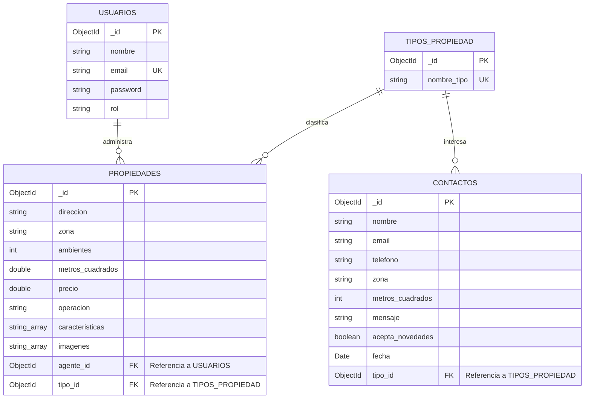

# Trabajo Práctico Intermedio: Diseño del Modelo de Datos (v5 - Final)
**Curso:** Desarrollo Back End  
**Proyecto:** Nuevo Techo Propiedades & Hogar (Sistema de Gestión y Catálogo de Inmuebles)  
**Autor:** Leandro Spitale  

---

## Sección 1: Elección del Dominio

Esta aplicación es un sistema de gestión interna y back - office para la inmobiliaria **"Nuevo Techo Propiedades & Hogar"**, diseñados para que los **agentes de la empresa** administren el catalogo de inmuebles en venta/alquiler y supervisen la solicitudes de contacto recibidas.

Para dar respuesta al modelo de negocio, se identifican las siguientes colecciones:
*   **Usuarios (Quién usa el sistema):** El personal de la inmobiliaria (Agentes), con un campo para diferenciar permisos (administrador vs. agente) [1].
*   **Entidad Principal (Corazón del negocio):** Las **Propiedades** del catálogo que la inmobiliaria gestiona [1].
*   **Entidad Referenciada:** Los **Tipos de Propiedad** (Casa, Departamento, etc.) para normalizar el catálogo y evitar inconsistencias [1].
*   **Colección Adicional:** **Contactos** para almacenar las solicitudes directas del formulario de tasación de la web.

---

## Sección 2: Diagrama del Modelo de Datos

Estructura lógica y relaciones del modelo (DER):



### Detalle de Colecciones y Tipos de Datos (Orientado a Mongoose/MongoDB)

#### 1. Colección: `Usuarios`
Representa al personal autorizado para operar en el Back-End de la inmobiliaria.
*   `_id` (**ObjectId**): Identificador único del usuario (Clave Primaria).
*   `nombre` (**String**): Nombre completo del agente o administrador.
*   `email` (**String**): Correo electrónico corporativo (Único y obligatorio).
*   `password` (**String**): Contraseña encriptada (con Bcrypt) para validar el acceso.
*   `rol` (**String**): Permisos del sistema (ej. `"administrador"` o `\"agente\"`).

#### 2. Colección: `Tipos_Propiedad`
Catálogo auxiliar cerrado para evitar la dispersión de categorías de inmuebles.
*   `_id` (**ObjectId**): Identificador único de la categoría (Clave Primaria).
*   `nombre_tipo` (**String**): Nombre estandarizado (ej. `\"Casa\"`, `\"Departamento\"`, `\"Oficina\"`, `\"PH\"`). Único y obligatorio.

#### 3. Colección: `Propiedades`
Catálogo físico de propiedades del mercado que se expone en la web.
*   `_id` (**ObjectId**): Identificador único de la propiedad (Clave Primaria).
*   `direccion` (**String**): Calle, altura y datos de piso/depto.
*   `zona` (**String**): Barrio o localidad para facilitar agrupamientos (ej. `\"Palermo\"`, `\"Puerto Madero\"`, `\"San Isidro\"`).
*   `ambientes` (**Number** / **Integer**): Cantidad total de ambientes.
*   `metros_cuadrados` (**Number**): Superficie del inmueble en metros cuadrados.
*   `precio` (**Number**): Valor de mercado del inmueble en dólares (USD).
*   `operacion` (**String**): Tipo de transacción (únicos valores válidos: `\"Venta\"` o `\"Alquiler\"`).
*   `caracteristicas` (**Array de Strings**): Atributos cualitativos destacados (ej. `[\"Jardín\", \"Balcón\", \"Pileta\"]`).
*   `imagenes` (**Array de Strings**): Direcciones de almacenamiento o URLs de las imágenes (ej. `[\"/img/venta/casa.png\"]`).
*   `agente_id` (**ObjectId**): Clave foránea que referencia al agente responsable en la colección de `Usuarios`.
*   `tipo_id` (**ObjectId**): Clave foránea que referencia a la categoría de inmueble en la colección de `Tipos_Propiedad`.

#### 4. Colección: `Contactos` (Formulario de Tasaciones)
Registra las peticiones de contacto recibidas desde el Front-End en React.
*   `_id` (**ObjectId**): Identificador único de la solicitud (Clave Primaria).
*   `nombre` (**String**): Nombre del cliente interesado (Obligatorio).
*   `email` (**String**): Correo electrónico de contacto del cliente (Obligatorio).
*   `telefono` (**String**): Teléfono del cliente.
*   `zona` (**String**): Barrio de interés o donde se ubica el inmueble a tasar.
*   `metros_cuadrados` (**Number**): Superficie aproximada para tasación.
*   `mensaje` (**String**): Comentarios o detalles adicionales.
*   `acepta_novedades` (**Boolean**): Si el usuario aceptó recibir correos promocionales.
*   `fecha` (**Date**): Timestamp automático de creación para ordenamiento.
*   `tipo_id` (**ObjectId**): Clave foránea que referencia el tipo de inmueble de su interés en la colección `Tipos_Propiedad`.

---

## Sección 3: Justificación de "Embeber vs. Referenciar"

Acá explico por qué decidí separar las cosas en colecciones distintas en vez de meter todo junto amontonado, que es clave para que la base de datos no sea un dolor de cabeza en el futuro:

1.  **Colección `Tipos_Propiedad` (Referenciada):**
    *   *Para evitar un quilombo en los filtros:* Si ponía el tipo de propiedad como un simple texto libre embebido dentro de cada inmueble (ej: tipo: `\"Depto\"`), los agentes iban a escribir cualquier cosa por error. Uno iba a poner `\"Depto\"`, otro `\"departamento\"`, otro `\"Dpto\"` o `\"PH\"` con minúsculas. Cuando quisiéramos programar el buscador filtrado en React, se nos iba a romper todo o iba a ser un dolor de cabeza unificar criterios. Referenciar una colección estricta obliga a usar categorías estandarizadas desde un menú desplegable.
    *   *Mantenibilidad:* Si el día de mañana la inmobiliaria decide renombrar `\"PH\"` a `\"Propiedad Horizontal\"` o agregar `\"Local Comercial\"`, basta con editar un único documento en `Tipos_Propiedad` y el cambio se refleja al instante en todo el sistema, sin tener que andar tocando miles de propiedades cargadas.

2.  **Colección `Usuarios` (Referenciada):**
    *   *Evitar redundancia masiva:* Un agente de nuestra plantilla maneja un montón de propiedades a la vez. Si embebiéramos todos sus datos (nombre, mail, contraseña encriptada) adentro de cada propiedad que tiene asignada, estaríamos duplicando datos sensibles por todos lados de forma recontra ineficiente.
    *   *Mantenibilidad:* Al referenciar el `agente_id`, si el agente llega a cambiar su número de teléfono corporativo, su mail o su contraseña de acceso, lo modificamos en un solo documento dentro de la colección `Usuarios` y listo, no hay riesgo de que queden registros viejos o inconsistentes en las propiedades.

3.  **Colección `Contactos` -> Referencia a `Tipos_Propiedad`:**
    *   *Coherencia con el formulario:* En el formulario de tasación de la web de React, el cliente elige el tipo de propiedad desde un `<select>`. Enviar el ID del tipo de propiedad referenciado hace que la base de datos guarde la consulta de manera limpia y estructurada, facilitando que después podamos filtrar los mensajes recibidos por tipo de inmueble de interés sin que se mezcle nada.

4.  **Amenidades e Imágenes (Embebidas como Arrays dentro de `Propiedades`):**
    *   *Relación contenida:* Las imágenes y las características cualitativas (como `\"Jardín\"`, `\"Pileta\"` o `\"Balcón\"`) le pertenecen exclusivamente a un inmueble y no tienen lógica propia fuera de él. Al embeberlas en Arrays de Strings dentro de `Propiedades`, optimizamos la velocidad de lectura: en una sola consulta traemos la ficha de la propiedad con todas sus fotos y detalles cualitativos, haciendo que la página vuele.

---

## Sección 4: Índices Propuestos

Para que la API vuele y el servidor de Express procese todas las búsquedas de la web de React de forma instantánea, propongo estos índices optimizados:

1.  **Índice Único en `email` (Colección `Usuarios`):**
    *   *Propósito:* Asegura que a nivel de motor de base de datos no existan duplicados de cuentas de agentes, previniendo colisiones en el login.
2.  **Índice Compuesto en `precio` y `operacion` (Colección `Propiedades`):**
    *   *Propósito:* Optimiza las búsquedas más comunes que hacen los clientes en la web (ej: "buscar departamentos en Alquiler ordenados por precio" o "casas en Venta hasta USD 150.000"). Con este índice, el motor no tiene que andar barriendo toda la base de datos de punta a punta en cada filtro.
3.  **Índice en `zona` (Colección `Propiedades`):**
    *   *Propósito:* Acelera la carga cuando el buscador por texto libre en React solicita propiedades filtrando por barrios muy buscados como `\"Palermo\"` u `\"Olivos\"`.
4.  **Índice en `fecha` (Colección `Contactos`):**
    *   *Propósito:* Optimiza la carga del Dashboard administrativo del Back-End para listar de manera descendente (los mensajes más recientes primero) las consultas de tasación recibidas.

---

## Sección 5: Documentos de Ejemplo (Formato JSON)

A continuación, presento documentos coherentes y basados en los datos de las cards de tu web real **"Nuevo Techo Propiedades & Hogar"**, garantizando la **integridad referencial** mediante IDs que simulan un entorno real:

### 1. Colección: `Usuarios`
```json
[
  {
    "_id": { "$oid": "66d86ef2e4b3c7d501a4bc81" },
    "nombre": "Leandro Spitale",
    "email": "leandro@nuevotecho.com.ar",
    "rol": "administrador"
  },
  {
    "_id": { "$oid": "66d86ef2e4b3c7d501a4bc82" },
    "nombre": "Federico Rossi",
    "email": "federico.rossi@nuevotecho.com.ar",
    "rol": "agente"
  }
]
```

### 2. Colección: `Tipos_Propiedad`
```json
[
  {
    "_id": { "$oid": "66d86fb5e4b3c7d501a4bc91" },
    "nombre_tipo": "Departamento"
  },
  {
    "_id": { "$oid": "66d86fb5e4b3c7d501a4bc92" },
    "nombre_tipo": "Casa"
  },
  {
    "_id": { "$oid": "66d86fb5e4b3c7d501a4bc93" },
    "nombre_tipo": "Oficina"
  }
]
```

### 3. Colección: `Propiedades` *(Basado en las Cards reales de tu web)*
```json
[
  {
    "_id": { "$oid": "66d8712ae4b3c7d501a4bca1" },
    "direccion": "Av. del Libertador 1500, CABA",
    "zona": "Palermo",
    "ambientes": 3,
    "metros_cuadrados": 85.0,
    "precio": 120000.0,
    "operacion": "Venta",
    "caracteristicas": ["Jardín", "Luminoso"],
    "imagenes": ["img/destacadas/casa.jpeg"],
    "agente_id": { "$oid": "66d86ef2e4b3c7d501a4bc82" },
    "tipo_id": { "$oid": "66d86fb5e4b3c7d501a4bc92" }
  },
  {
    "_id": { "$oid": "66d8712ae4b3c7d501a4bca2" },
    "direccion": "Gorriti 4500, Palermo",
    "zona": "Palermo",
    "ambientes": 2,
    "metros_cuadrados": 45.0,
    "precio": 85000.0,
    "operacion": "Venta",
    "caracteristicas": ["Balcón", "Apto Profesional"],
    "imagenes": ["img/destacadas/departamento centrico.jpeg"],
    "agente_id": { "$oid": "66d86ef2e4b3c7d501a4bc82" },
    "tipo_id": { "$oid": "66d86fb5e4b3c7d501a4bc91" }
  },
  {
    "_id": { "$oid": "66d8712ae4b3c7d501a4bca3" },
    "direccion": "Sucre 2300, Belgrano",
    "zona": "Belgrano",
    "ambientes": 5,
    "metros_cuadrados": 180.0,
    "precio": 210000.0,
    "operacion": "Venta",
    "caracteristicas": ["Pileta", "Cochera", "Jardín"],
    "imagenes": ["img/destacadas/casa_con_pileta.jpeg"],
    "agente_id": { "$oid": "66d86ef2e4b3c7d501a4bc81" },
    "tipo_id": { "$oid": "66d86fb5e4b3c7d501a4bc92" }
  }
]
```

### 4. Colección: `Contactos` *(Basado en el Formulario de Tasaciones real de tu web)*
```json
[
  {
    "_id": { "$oid": "66d8738fe4b3c7d501a4bcb1" },
    "nombre": "Claudio Benítez",
    "email": "claudio.benitez@gmail.com",
    "telefono": "+54 11 9876-5432",
    "zona": "Olivos",
    "metros_cuadrados": 90,
    "mensaje": "Hola, solicito tasación para mi departamento de 3 ambientes en zona norte. Gracias.",
    "acepta_novedades": true,
    "fecha": { "$date": "2026-09-04T12:00:00Z" },
    "tipo_id": { "$oid": "66d86fb5e4b3c7d501a4bc91" }
  }
]
```
