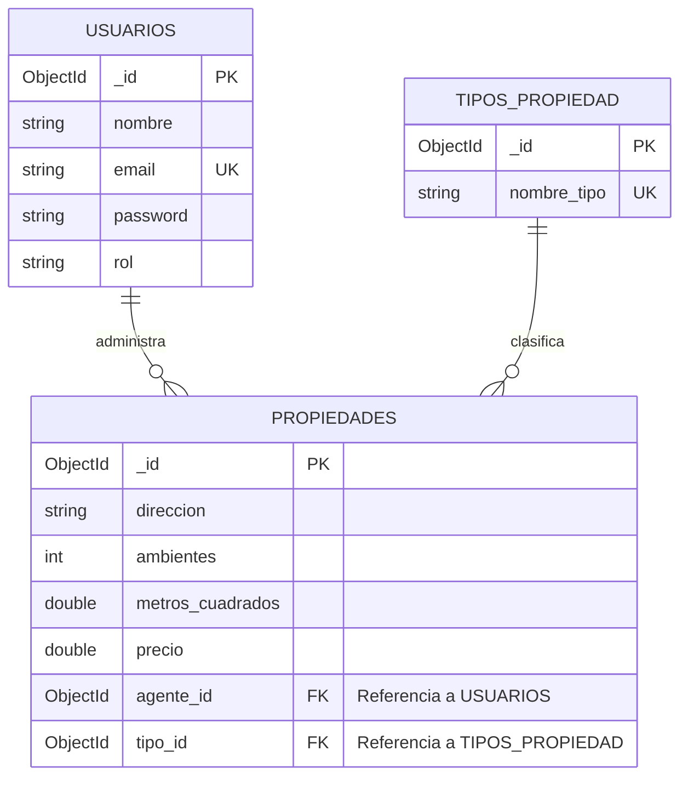

[tp-diseno-inmobiliaria.md](https://github.com/user-attachments/files/31813896/tp-diseno-inmobiliaria.1.md)


# Trabajo Práctico Intermedio: Diseño del Modelo de Datos
**Curso:** Desarrollo Back End  
**Dominio Elegido:** Sistema de Gestión Interna Inmobiliaria (ERP/Back-office)  
**Autor:** Leandro Spitale  

---

## Sección 1: Elección del Dominio

El dominio seleccionado consiste en un **Sistema de Gestión Interna para una Inmobiliaria propia**. A diferencia de un portal público y abierto de búsqueda (estilo Zonaprop o MercadoLibre Inmuebles), este sistema está diseñado para el uso exclusivo del personal de la inmobiliaria (agentes y administradores). 

La plataforma permite:
1. Administrar el catálogo de propiedades disponibles para venta o alquiler.
2. Controlar qué agente de la empresa es el responsable directo de la gestión y muestra de cada propiedad.
3. Clasificar de forma estandarizada los inmuebles según su tipo para facilitar la posterior búsqueda y filtrado en la interfaz de usuario.

Los actores principales del sistema son los **Agentes** (usuarios administradores o empleados con permisos de escritura), quienes alimentan y actualizan las características físicas de las **Propiedades** (dirección, ambientes, metros cuadrados, precio, etc.), las cuales a su vez pertenecen a un **Tipo de Propiedad** preestablecido.

---

## Sección 2: Diagrama del Modelo de Datos

A continuación, se detalla la estructura lógica de la base de datos utilizando la sintaxis de **Mermaid**, la cual se renderiza de forma nativa en GitHub, acompañada de la descripción detallada de sus campos.



### Detalle de Colecciones y Tipos de Datos (Orientado a Mongoose/MongoDB)

#### 1. Colección: `Usuarios`
Representa al personal autorizado para operar en el Back-End de la inmobiliaria.
*   `_id` (**ObjectId**): Identificador único de usuario (Clave Primaria).
*   `nombre` (**String**): Nombre completo del agente.
*   `email` (**String**): Correo electrónico (Debe ser único y obligatorio).
*   `password` (**String**): Contraseña encriptada para el acceso al panel.
*   `rol` (**String**): Rol en la empresa (ej. `"administrador"`, `"agente"`) para control de permisos.

#### 2. Colección: `Tipos_Propiedad`
Colección auxiliar para normalizar la clasificación de los inmuebles.
*   `_id` (**ObjectId**): Identificador único del tipo de propiedad (Clave Primaria).
*   `nombre_tipo` (**String**): Nombre de la categoría (ej. `"Casa"`, `"Departamento"`, `"PH"`, `"Local"`). Debe ser único y obligatorio.

#### 3. Colección: `Propiedades`
Colección principal que almacena los inmuebles del catálogo.
*   `_id` (**ObjectId**): Identificador único de la propiedad (Clave Primaria).
*   `direccion` (**String**): Ubicación física del inmueble.
*   `ambientes` (**Number** / **Integer**): Cantidad de ambientes.
*   `metros_cuadrados` (**Number**): Superficie total en metros cuadrados.
*   `precio` (**Number** / **Decimal**): Valor monetario del inmueble en dólares (USD).
*   `agente_id` (**ObjectId**): Clave foránea que referencia al agente responsable en la colección de `Usuarios`.
*   `tipo_id` (**ObjectId**): Clave foránea que referencia a la categoría en la colección de `Tipos_Propiedad`.

---

## Sección 3: Justificación de "Embeber vs. Referenciar"

En el diseño de esquemas de bases de datos, la decisión de **referenciar** colecciones en lugar de **embeberlas** es un pilar fundamental para garantizar la escalabilidad y consistencia del negocio. Para este modelo inmobiliario se optó estrictamente por **referenciar** debido a las siguientes razones teóricas y prácticas:

1.  **Colección `Tipos_Propiedad` (Referenciada):**
    *   *Consistencia y normalización:* Si el tipo de propiedad fuese una propiedad de texto libre embebida dentro de cada documento de `Propiedades`, correríamos el riesgo de que un agente escriba `"Departamento"`, otro `"depto"`, y otro `"departamento"`. Esto rompería la integridad de la base de datos y haría ineficiente el filtro de búsqueda de la API.
    *   *Reutilización:* Los tipos de inmuebles son un catálogo cerrado que se reutiliza constantemente. Al referenciar un único ID, garantizamos que si en el futuro se requiere renombrar `"PH"` a `"Propiedad Horizontal"`, se cambie en un solo documento de la base de datos y se actualice automáticamente en todo el sistema sin tener que barrer millones de propiedades.

2.  **Colección `Usuarios` / Agentes (Referenciada):**
    *   *Evitar redundancia de datos:* Un agente inmobiliario de nuestra plantilla suele tener a su cargo decenas de propiedades. Si embebiéramos los datos del agente (nombre, email, credenciales) dentro de cada propiedad, duplicaríamos información sensible de manera masiva.
    *   *Mantenibilidad:* Al referenciar el `agente_id`, la modificación de los datos de contacto o del rol del empleado se gestiona de forma centralizada en su propio documento en la colección `Usuarios`, evitando inconsistencias y registros huérfanos.

---

## Sección 4: Índices Propuestos

Para optimizar el rendimiento de la base de datos y acelerar los tiempos de respuesta de las futuras consultas de la API, se proponen los siguientes índices:

1.  **Índice Único en `email` (Colección `Usuarios`):**
    *   *Propósito:* Garantiza a nivel de motor de base de datos que no existan dos usuarios registrados con la misma dirección de correo electrónico, previniendo duplicados de cuentas de agentes.
2.  **Índice en `precio` (Colección `Propiedades`):**
    *   *Propósito:* Optimiza las consultas por rango de valores (ej. buscar propiedades entre USD 100.000 y USD 200.000), una de las operaciones más comunes y pesadas en un sistema inmobiliario.
3.  **Índice en `tipo_id` (Colección `Propiedades`):**
    *   *Propósito:* Acelera las búsquedas cuando la API filtra las propiedades por su tipo (por ejemplo, mostrar únicamente los departamentos disponibles).

---

## Sección 5: Documentos de Ejemplo (Formato JSON)

A continuación, se presentan 3 documentos reales por cada colección que demuestran la **integridad referencial** del esquema. Los campos `agente_id` y `tipo_id` en las propiedades coinciden perfectamente con los identificadores `_id` de sus colecciones correspondientes.

### 1. Documentos de la Colección: `Usuarios`
```json
[
  {
    "_id": { "$oid": "66d5e1b1c3a2b4e5f6a70001" },
    "nombre": "Ana Martínez",
    "email": "ana.martinez@tuinmobiliaria.com",
    "rol": "administrador"
  },
  {
    "_id": { "$oid": "66d5e1b1c3a2b4e5f6a70002" },
    "nombre": "Carlos Gómez",
    "email": "carlos.gomez@tuinmobiliaria.com",
    "rol": "agente"
  },
  {
    "_id": { "$oid": "66d5e1b1c3a2b4e5f6a70003" },
    "nombre": "Lucía Fernández",
    "email": "lucia.fernandez@tuinmobiliaria.com",
    "rol": "agente"
  }
]
```

### 2. Documentos de la Colección: `Tipos_Propiedad`
```json
[
  {
    "_id": { "$oid": "66d5e1b1c3a2b4e5f6a79991" },
    "nombre_tipo": "Departamento"
  },
  {
    "_id": { "$oid": "66d5e1b1c3a2b4e5f6a79992" },
    "nombre_tipo": "Casa"
  },
  {
    "_id": { "$oid": "66d5e1b1c3a2b4e5f6a79993" },
    "nombre_tipo": "PH"
  }
]
```

### 3. Documentos de la Colección: `Propiedades`
```json
[
  {
    "_id": { "$oid": "66d5e1b1c3a2b4e5f6a78881" },
    "direccion": "Av. del Libertador 1500, CABA",
    "ambientes": 3,
    "metros_cuadrados": 85.0,
    "precio": 210000.0,
    "agente_id": { "$oid": "66d5e1b1c3a2b4e5f6a70002" },
    "tipo_id": { "$oid": "66d5e1b1c3a2b4e5f6a79991" }
  },
  {
    "_id": { "$oid": "66d5e1b1c3a2b4e5f6a78882" },
    "direccion": "Gorriti 4500, Palermo",
    "ambientes": 2,
    "metros_cuadrados": 45.0,
    "precio": 115000.0,
    "agente_id": { "$oid": "66d5e1b1c3a2b4e5f6a70003" },
    "tipo_id": { "$oid": "66d5e1b1c3a2b4e5f6a79991" }
  },
  {
    "_id": { "$oid": "66d5e1b1c3a2b4e5f6a78883" },
    "direccion": "Sucre 2300, Belgrano",
    "ambientes": 5,
    "metros_cuadrados": 180.0,
    "precio": 350000.0,
    "agente_id": { "$oid": "66d5e1b1c3a2b4e5f6a70002" },
    "tipo_id": { "$oid": "66d5e1b1c3a2b4e5f6a79992" }
  }
]
```
